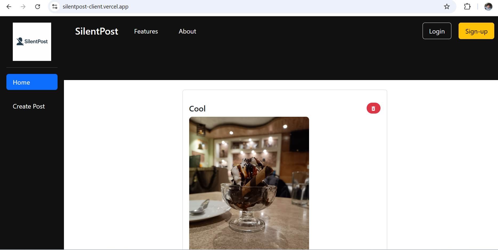

# SilentPost – Backend

<a href="https://silentpost-client.vercel.app/">
    
  </a>
</p>

<p align="center">
  A secure, anonymous social media platform backend built with Node.js, Express, and MongoDB.
  <br />
  <a href="https://github.com/sayank22/social-media"><strong>Explore the Docs »</strong></a>
   <br />
  <br />
</p>

</div>

---

<p align="center">
User Interface
<br />
  <a href="https://silentpost-client.vercel.app/">
    
  </a>
</p>
<br />
<div align="center">

## 📝 About SilentPost

SilentPost is a social media platform that allows users to share posts anonymously, engage through reactions, and manage personal profiles—all within a secure, JWT-authenticated environment.

---

## 🔧 Tech Stack

- **Frontend:** React, HTML, CSS, Bootstrap  
- **Backend:** Node.js, Express.js  
- **Database:** MongoDB  
- **Authentication:** JWT (JSON Web Tokens)  

---

## 🚀 Key Features

- ✅ User Authentication with JWT  
- 📝 Create and Delete Posts  
- 💬 Toggle Reactions on Posts  
- 👤 Anonymous User Profiles  
- 🔐 Route Protection via Middleware  

---

## 📂 Folder Structure

backend/ ├── controllers/ │ ├── postController.js │ └── userController.js ├── middleware/ │ └── authMiddleware.js ├── models/ │ ├── postModel.js │ └── user.js ├── routes/ │ ├── postRoutes.js │ └── userRoutes.js ├── .env ├── app.js └── server.js


---

## ⚙️ Environment Variables

Create a `.env` file inside the `backend/` directory with the following:

```env
PORT=5000
MONGODB_URI=your_mongo_connection_string
JWT_SECRET=your_jwt_secret

📌 API Endpoints
🔐 Authentication
POST /api/users/signup – Register new users

POST /api/users/login – Login and receive a JWT

🧾 Posts
GET /api/posts/ – Get all posts

GET /api/posts/:id – Get a specific post by ID

POST /api/posts/ – Create a new post (auth required)

DELETE /api/posts/:id – Delete your post (auth required)

POST /api/posts/:id/toggle-reaction – Like/Unlike a post (auth required)

GET /api/posts/user/:userId – Get posts by a specific user (auth required)

🛠️ Getting Started
Prerequisites
Node.js

MongoDB (Atlas or local)

Steps
# Clone the repo
git clone https://github.com/sayank22/SilentPost.git

# Go into the backend directory
cd SilentPost/backend

# Install dependencies
npm install

# Start the server
node app.js

Backend will run at http://localhost:5000

👨‍💻 About the Developer
Sayan Kundu – A 23-year-old CSE student from Netaji Subhash Engineering College, passionate about real-world web development and building engaging user-centric apps.


📬 Contact the Developer
Sayan Kundu
📧 [sayank10023@gmail.com](mailto:sayank10023@gmail.com)  
💼 [LinkedIn](https://www.linkedin.com/in/sayan-kundu-70b5442b6)  
🐱 [GitHub](https://github.com/sayank22)


Backend designed and built with by Sayan Kundu