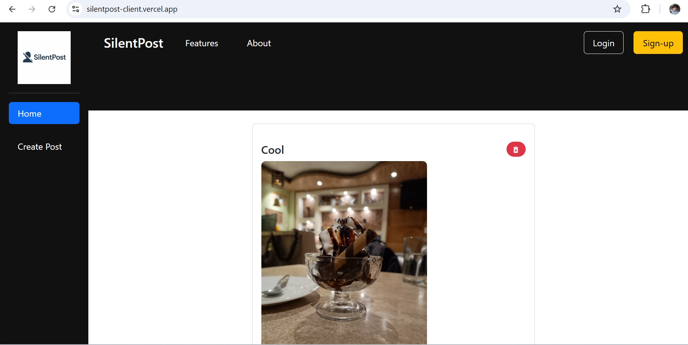

# SilentPost – Frontend

  <a href="https://silentpost-client.vercel.app/">
    
  </a>
</p>

<p align="center">
  A secure, anonymous social media platform backend built with Node.js, Express, and MongoDB.
  <br />
  <a href="https://github.com/sayank22/social-media"><strong>Explore the Docs »</strong></a>
  <br />
  <br />
</p>

</div>

---

<p align="center">
User Interface
<br />
  <a href="https://silentpost-client.vercel.app/">
    
  </a>
</p>

<br />
<div align="center">

## 📝 About SilentPost

SilentPost is a social media platform that allows users to share posts anonymously, engage through reactions, and manage personal profiles—all within a secure, JWT-authenticated environment.

---

## 🛠️ Frontend Tech Stack

- ⚛️ **React.js**
- 🎨 **CSS**
- 🧰 **Bootstrap**
- 🛣️ **React Router**
- 🌐 **Axios** – for backend API requests
- 🗂️ **Context API + Reducer** – for state management
- ⚡ **Vite** – for lightning-fast development and builds

---

## 📸 Preview

<p align="center">
  
</p>

---

## ✨ Key Features

- 🔐 JWT-based user authentication
- 📝 Create and delete posts anonymously
- 💬 Toggle reactions (like) per user
- 🧭 Navigation via React Router
- 📱 Fully responsive and mobile-friendly
- 🗂️ Context + Reducer based global state

---

## 📁 Folder Structure

frontend/ ├── public/ ├── src/ │ ├── assets/ │ ├── components/ │ │ ├── Header.jsx │ │ ├── Sidebar.jsx │ │ ├── Footer.jsx │ │ └── Post.jsx │ ├── context/ │ │ ├── AuthContext.jsx │ │ ├── PostContext.jsx │ │ └── reducer.js │ ├── pages/ │ │ ├── Home.jsx │ │ ├── Login.jsx │ │ ├── Signup.jsx │ │ └── CreatePost.jsx │ ├── App.jsx │ ├── main.jsx │ └── app.css ├── .env ├── index.html └── vite.config.js


---

## ⚙️ Environment Variables

Create a `.env` file in the `frontend/` directory:

```env
VITE_API_URL=https://silentpost-server.onrender.com


Prerequisites
Ensure Node.js and Vite are installed.

Local Development

# Clone the repository
git clone https://github.com/sayank22/SilentPost.git

# Navigate into the frontend directory
cd SilentPost/frontend

# Install frontend dependencies
npm install

# Start the local development server
npm run dev

Open http://localhost:5173 to view the app in your browser.

📦 Building for Production
To build the app for deployment:

npm run build

This will generate a dist/ folder with optimized production-ready static files. You can deploy it using Vercel, Netlify, or any static hosting service.

🌐 Live Project Links
🎯 Frontend: silentpost-client.vercel.app

🔙 Backend API: silentpost-server.onrender.com

📬 Contact the Developer
Sayan Kundu
📧 [sayank10023@gmail.com](mailto:sayank10023@gmail.com)  
💼 [LinkedIn](https://www.linkedin.com/in/sayan-kundu-70b5442b6)  
🐱 [GitHub](https://github.com/sayank22)


Designed & Developed with ❤️ by Sayan Kundu